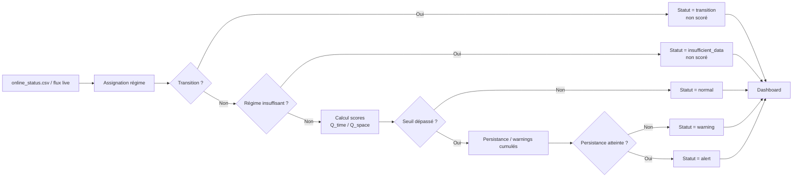

# Brief de conception du dashboard Streamlit Bi2DPCA GTA

## Résumé exécutif

Le dashboard doit être conçu comme un **double produit** : un **cockpit décisionnel** pour savoir rapidement quel GTA requiert une attention immédiate, et un **outil d’audit du modèle** pour comprendre **où commencent les alertes, dans quel régime, avec quels scores `Q_time` / `Q_space`, et sur quelles variables la structure semble changer**. La bonne architecture n’est pas une simple page unique “KPI + graphes”, mais une **application multipage** avec une hiérarchie d’information explicite : **vue d’ensemble**, **zoom/filtre**, puis **détails à la demande**. Cette logique suit directement le principe d’interaction “overview first, zoom and filter, then details-on-demand”, qui reste une référence solide pour les systèmes de visualisation exploratoire. citeturn9search0turn9search21

Pour Streamlit, la base recommandée est une **app multipage** pilotée par `st.Page` et `st.navigation`, avec un **état partagé** via `st.session_state` entre les pages. Cette combinaison est aujourd’hui la voie préférée par Streamlit pour les apps multipages, et `Session State` persiste bien entre pages dans une même application. citeturn0search8turn6search10turn1search1turn1search5

La stratégie de données doit être **CSV/JSON-first, bundle-second** : le dashboard lit d’abord `summary_all_gta.csv`, `online_status.csv`, `online_report.json`, `metrics.json`, `regime_summary.csv`, `diagnostic_mp.json` et les figures existantes. `bundle.pkl` ne doit être utilisé qu’en **complément** si une information nécessaire n’existe pas déjà sous forme tabulaire ou JSON. Cela simplifie le rendu, réduit le couplage au pipeline et rend l’interface plus robuste au mode “lecture seule”. En Streamlit, les jeux tabulaires/JSON doivent être chargés avec `st.cache_data`, tandis que les objets lourds et potentiellement singleton doivent être réservés à `st.cache_resource`, qui reste mutable par nature. citeturn1search0turn1search4turn1search12

Enfin, le dashboard doit être pensé en **deux modes d’exploitation** : **Replay** pour l’analyse historique et la validation, puis **Live** pour le suivi quasi temps réel. Streamlit fournit pour cela `@st.fragment(run_every=...)`, qui permet de rafraîchir seulement certaines zones de l’interface sans relancer toute l’app. Cette capacité est précisément adaptée à un bandeau KPI ou à une timeline de monitoring. citeturn3search0turn3search4turn3search7turn3search18

## Architecture fonctionnelle recommandée

La structure idéale est un **noyau de données**, puis des **pages spécialisées**. Le noyau de données a trois responsabilités : lire les artefacts, les normaliser en schémas stables, et exposer des vues prêtes à afficher. L’app elle-même ne recalcule rien du modèle : elle **visualise** et **explique** les résultats existants.

La navigation doit être construite nativement avec `st.Page` et `st.navigation`, car cette approche est désormais préférée à la simple convention `pages/` quand on veut maîtriser l’ordre, les labels, la logique d’accès et les éléments communs. Le sélecteur principal global doit vivre dans la **sidebar**, qui est précisément conçue pour héberger des contrôles persistants. Pour les filtres coûteux (dates, régime, statut, mode Replay/Live), il est conseillé d’utiliser un `st.form` dans la sidebar afin de **batcher** les changements et éviter un rerun complet à chaque clic. citeturn0search0turn6search22turn6search3turn6search11turn6search18

L’état transverse doit reposer sur `st.session_state` : GTA courant, période courante, régime sélectionné, alerte sélectionnée, fenêtre de comparaison “normale vs alertée”, mode Replay/Live et cadence de rafraîchissement. Si l’équipe veut un **permalien partageable** vers un diagnostic précis, `st.query_params` peut servir pour sérialiser une partie de cet état dans l’URL. Il faut cependant tenir compte d’une contrainte importante : les query params sont normalement effacés lors de la navigation entre pages, sauf si l’on navigue explicitement avec `st.switch_page(..., query_params=...)`. Pour un drill-down inter-pages, le bon couple est donc **`session_state` pour la continuité** et **`switch_page(query_params=...)` pour le partage**. citeturn7search0turn8view0

Côté versioning, un **ciblage recommandé en Streamlit ≥ 1.58** donne accès aux améliorations récentes, notamment `parallel=True` sur `@st.fragment`. Le minimum fonctionnel dépend des besoins : **≥ 1.37** si l’on veut les fragments de rafraîchissement, et **≥ 1.35** si l’on veut la sélection de lignes sur `st.dataframe`. citeturn3search18turn5view1

## Sources de données et contrat minimal

Les **sources obligatoires** du dashboard sont celles-ci, avec ce rôle minimal :

| Source | Rôle principal dans le dashboard |
|---|---|
| `summary_all_gta.csv` | Comparaison globale inter-GTA, KPI, couverture, FAR, comptages |
| `artifacts/<GTA>/online_status.csv` | Série temporelle principale pour statuts, scores, régimes, drill-down |
| `artifacts/<GTA>/online_report.json` | Comptages online agrégés, synthèse du rejeu |
| `artifacts/<GTA>/metrics.json` | Métriques offline, FAR avant/après, exclusions, tests |
| `artifacts/<GTA>/regime_summary.csv` | Diagnostic par régime, seuils, effectifs, `d/p`, FAR par régime |
| `artifacts/<GTA>/diagnostic_mp.json` | Qualité capteur, justification d’exclusion, cas JFC3 |
| Figures (`monitoring_online.png`, `monitoring_test.png`, `far_vs_quantile.png`, etc.) | Référence visuelle, fallback ou comparaison “image vs données” |
| `bundle.pkl` | Optionnel : seuils, variables, metadata non exposées en CSV/JSON |

La couche de lecture doit produire un petit **contrat de données interne** stable :  
`global_summary`, `online_series`, `online_events`, `regime_metrics`, `model_validation`, `data_quality`, `metadata`. Ce contrat permet de décorréler les pages des fichiers bruts. Le principe clé est le suivant : **les pages n’accèdent jamais directement à des chemins de fichiers**, elles consomment des tables/objets normalisés.

Pour les performances, les lecteurs CSV/JSON doivent être décorés avec `st.cache_data`, car Streamlit recommande ce mécanisme pour les transformations et chargements de données, en renvoyant des copies sûres vis-à-vis des mutations et des conditions de course. `bundle.pkl`, s’il doit être lu, peut être mis derrière un adaptateur dédié et éventuellement `st.cache_resource`, mais seulement s’il reste strictement **read-only** dans l’app. citeturn1search0turn1search4turn1search12

Le dashboard doit aussi distinguer **deux modes de fraîcheur**. En **Replay**, il lit des artefacts figés et privilégie l’exploration. En **Live**, il relit périodiquement `online_status.csv` ou une source équivalente mise à jour par le pipeline. Pour ce mode Live, il vaut mieux rafraîchir uniquement les composants utiles — cartes KPI, bandeau de statut, timeline principale — avec `@st.fragment(run_every=...)`, plutôt que de rerendre toute la page. Si plusieurs fragments sont employés, la version récente de Streamlit permet même un mode parallèle pour garder l’interface réactive. citeturn3search0turn3search4turn3search18

## Pages et visuels à implémenter

### Vue globale

Cette page doit répondre en moins de dix secondes à la question : **“Quel GTA pose problème maintenant, et est-ce un problème de procédé, de couverture ou de modèle ?”** Elle doit présenter une **grille de cartes** par GTA avec `st.metric`, car ce composant est fait pour afficher une métrique principale, un delta, et éventuellement une petite sparkline via `chart_data`. citeturn3search3

Chaque carte GTA doit afficher au minimum : statut dominant récent, `FAR_calib_before / after`, `n_modeled`, `n_insufficient_regimes`, `n_scored_total`, `n_non_scored_total`, `normal/warning/alert`, et les exclusions éventuelles (`exclude_vars`, `exclude_reason`). Le visuel complémentaire recommandé est un **bar-stacked horizontal** des statuts et un tableau comparatif triable. `st.dataframe` convient bien ici car la table reste interactive, triable et exploitable sans permettre l’édition. citeturn5view0turn5view1

Le drill-down doit être explicite : bouton ou clic pour ouvrir la page “Monitoring temporel” du GTA sélectionné.

### Monitoring temporel

C’est la **page centrale de monitoring**. Elle doit montrer, sur une même période filtrable, quatre couches visuelles :  
la **timeline des statuts**, la **bande de régime**, la courbe `Q_time`, puis la courbe `Q_space`.

Le meilleur support est un ou plusieurs **graphiques Plotly**, car `st.plotly_chart` est interactif, supporte les sélections, et peut déclencher un rerun via `on_select`. C’est ce qui permet un vrai **click-to-drill** sans composant exotique. La doc Streamlit précise d’ailleurs que le chart peut se comporter comme un widget avec sélection directe, box ou lasso. citeturn4view0

La bande de régime doit être **visuellement distincte** des scores. Le code couleur recommandé est fixe et global à toute l’app :  
vert `normal`, orange `warning`, rouge `alert`, gris `transition`, violet `insufficient_data`, bleu-gris `unknown_regime`. La règle essentielle est de **ne jamais fondre transition et alerte dans la même teinte**.

Il faut également afficher les **zones non scorées** comme une information de premier plan, pas comme un bruit de fond. Pour l’équipe décision, un GTA qui ne score pas n’est pas “normal” : il est **non observable** sur cette période.

Enfin, pour les longues périodes ou les gros volumes, il faudra limiter les points visibles, proposer un sous-échantillonnage ou utiliser un rendu SVG lorsque le nombre de points et le nombre de graphiques par page deviennent importants. Streamlit rappelle que Plotly bascule en WebGL au-delà d’environ 1000 points, et que des limites de contextes WebGL peuvent apparaître avec plusieurs chartes simultanées. citeturn4view0

### Diagnostic alerte

Cette page doit répondre à : **“Pourquoi cette alerte existe-t-elle ?”**  
Elle s’ouvre soit via un clic sur la timeline, soit via une sélection de ligne dans une table d’événements. La sélection de ligne est nativement gérée par `st.dataframe` avec `on_select`, et les lignes sélectionnées peuvent ensuite piloter les visuels adjacents. citeturn5view0turn5view1

Le panneau principal doit afficher : GTA, horodatage, régime, statut, `reason_codes`, `Q_time`, `Q_space`, seuils du régime, persistance, et précédentes fenêtres contributives. Le cœur visuel doit être un **comparatif de fenêtre** :  
une fenêtre “alertée” versus une fenêtre “normale” du **même régime**, sur les variables disponibles (`HP`, `BP`, `MP`, `EE` selon le GTA). Cette comparaison peut prendre la forme de courbes superposées, d’un petit heatmap `temps × variables`, ou d’un double panneau normal/alerte.

La règle de fond est importante : le dashboard ne doit pas **inventer une causalité**. Il doit montrer que **la structure dynamique change** et donner les éléments visuels qui appuient cette conclusion.

### Régimes

Cette page sert à séparer **problème procédé** et **problème de modélisation des régimes**. Elle affiche `regime_summary.csv` sous forme de tableau triable et de quelques visuels simples : barres d’effectifs, FAR par régime, seuils, statut du régime (`modeled` vs `insufficient_data`), dimensions `d/p`.

Cette page doit rendre immédiatement visibles les cas suivants :  
régime sous-peuplé, seuil instable, FAR test élevé malgré FAR calib sain, exclusion du régime, variables exclues côté GTA. C’est ici que le cas “régime 2 JFC1” devient lisible pour l’équipe technique sans polluer la page d’accueil.

### Validation modèle

Cette page documente la **crédibilité opérationnelle** du modèle. Elle doit agréger les résultats cross-GTA : `FAR_calib_before`, `FAR_calib_after`, `n_modeled`, `n_insufficient_regimes`, `n_unknown_regime`, `normal/warn/alert`, ainsi que les résultats des tests de dérive injectée et de pic isolé.

L’objectif n’est pas d’ajouter des graphes pour le principe, mais de répondre à :  
**“Est-ce que le modèle semble stable, et où sont ses limites actuelles ?”**

Cette page doit aussi exposer les points d’attention métier déjà connus, sans conclure trop vite :  
FAR JFC3 un peu au-dessus de la cible, régime 2 JFC1 à examiner, poids des zones `insufficient_data`, effets de couverture. C’est la page qui permet de discuter sérieusement de la **qualité du modèle** avant d’interpréter toutes les alertes comme des dégradations process.

### Qualité données

Cette page est indispensable après le cas JFC3. Elle affiche les métriques de qualité capteur : NaN, zéros, quasi-zéros, stuck, variables exclues, et impact de l’exclusion. Le couple `diagnostic_mp.json` + comparaison avec/sans variable doit y être central.

L’objectif est de faire passer un message clair :  
**une dérive process et une dégradation capteur ne sont pas interchangeables**.  
Le dashboard doit aider à ne pas confondre les deux.

### Méthode

Cette page joue un rôle de **documentation embarquée**. Elle doit résumer le pipeline de façon fidèle : chargement, prétraitement, régimes, fenêtres, apprentissage par régime, seuils, scoring online avec persistance. Elle doit rappeler explicitement que **`EE` est surveillée mais jamais prédite**, que les statuts `transition`, `unknown_regime` et `insufficient_data` sont **non scorés**, et que les alertes proviennent d’une rupture de structure mesurée par `Q_time` et `Q_space`.

Des **tabs** conviennent bien pour organiser cette page en “Flux”, “Glossaire”, “Statuts”, “Sources de données”. Attention toutefois à un détail utile : par défaut, Streamlit calcule tout le contenu des tabs, même quand elles sont masquées. Si certaines sections deviennent lourdes, il faut activer le suivi d’état des tabs avec `on_change="rerun"` afin de rendre possible un chargement paresseux. citeturn10view0

## Interactions, UX et considérations temps réel

L’interaction doit suivre une logique simple : **sélection globale → filtrage → sélection fine → export**.

Le **sélecteur GTA**, le **filtre de dates**, le **filtre de régime**, le **filtre de statut**, le **mode Replay/Live**, et le **toggle “comparer à une fenêtre normale”** doivent être persistants dans la sidebar. Cette recommandation correspond directement à l’usage attendu de `st.sidebar` pour des contrôles globaux visibles en permanence. citeturn6search3turn6search11

Le **click-to-drill** doit fonctionner de deux manières complémentaires. Premièrement, sur les graphiques Plotly via `on_select="rerun"` afin qu’un clic ou une sélection choisisse un point, une alerte ou une zone temporelle. Deuxièmement, sur les tableaux via `st.dataframe(..., on_select="rerun")`, ce qui suffit souvent pour sélectionner un évènement ou un régime. `st.plotly_chart` et `st.dataframe` sont donc les deux briques interactives principales à exploiter. citeturn4view0turn5view0turn5view1

Pour le **drill-down inter-pages**, il faut stocker l’objet sélectionné dans `st.session_state` et, si souhaité, naviguer avec `st.switch_page(page, query_params=...)` pour créer un lien partageable vers le diagnostic. Cette combinaison évite les faiblesses d’un simple passage par URL isolée. citeturn1search1turn8view0turn7search0

L’**export snapshot** doit être pensé comme un export de **contexte d’analyse**, pas seulement comme un téléchargement brut. Le minimum utile est :  
un CSV/JSON des données filtrées, un paquet “alerte sélectionnée” avec métadonnées et scores, et si possible une exportation HTML/PNG du visuel courant. `st.download_button` est prévu pour ce type d’usage. La doc précise aussi qu’il vaut mieux éviter de garder en mémoire de très gros fichiers, et qu’on peut différer la génération via un callable pour éviter de bloquer le script. citeturn6search1turn1search11

Le **mode Live** doit rester sobre. Un rafraîchissement toutes les 15 à 30 secondes pour les cartes et la timeline principale est généralement suffisant pour un monitoring industriel non milliseconde. Les pages d’audit plus lourdes peuvent rester en rafraîchissement manuel. L’usage de fragments est particulièrement adapté ici, d’autant plus qu’ils peuvent être isolés du reste de l’app. Si des fragments injectent dans plusieurs conteneurs, il faut utiliser des placeholders (`st.empty`) pour éviter l’accumulation d’éléments à chaque rerun. citeturn3search0turn3search11

Enfin, la robustesse UX doit être explicite :  
fichier absent ⇒ message `info/warning`, jamais crash ;  
GTA non scoré ⇒ badge et explication ;  
régime insuffisant ⇒ visible comme tel, jamais camouflé en “normal”.

## Livrables attendus, checklist et diagramme de flux

Le livrable cible est une app **modulaire** : `app.py` comme point d’entrée, des modules de lecture robustes, des pages séparées, un petit noyau d’état, et un README d’usage. Le point d’entrée doit lancer la navigation multipage via `st.navigation`, ce qui correspond à la structure recommandée par Streamlit. Pour l’usage développeur, la doc officielle continue d’utiliser le schéma standard `streamlit run app.py`. citeturn0search0turn6search10turn5view1

La structure minimale conseillée est la suivante, sans imposer de détail de code :

- `app.py`
- `dashboard/readers.py`
- `dashboard/state.py`
- `dashboard/charts.py`
- `dashboard/pages/overview.py`
- `dashboard/pages/monitoring.py`
- `dashboard/pages/alert_diagnostic.py`
- `dashboard/pages/regimes.py`
- `dashboard/pages/model_validation.py`
- `dashboard/pages/data_quality.py`
- `dashboard/pages/method.py`
- `README.md`

Le **checklist d’implémentation** peut rester court :

- mettre en place la navigation multipage et l’état global ;
- créer des lecteurs robustes pour chaque artefact requis ;
- normaliser les colonnes et les statuts (`normal`, `warning`, `alert`, `transition`, `unknown_regime`, `insufficient_data`) ;
- implémenter d’abord **Vue globale** et **Monitoring temporel** ;
- ajouter ensuite **Diagnostic alerte** avec comparaison fenêtre normale vs alertée ;
- finaliser les pages **Régimes**, **Validation modèle**, **Qualité données**, **Méthode** ;
- ajouter le mode Replay, puis le mode Live avec fragments ;
- ajouter les exports snapshot et le README d’exploitation.

Le diagramme Mermaid ci-dessous est une bonne base pour représenter le **flux d’alerte** dans la page “Méthode” ou dans le README. Mermaid supporte nativement les flowcharts et les sequence diagrams en syntaxe texte, ce qui le rend bien adapté à une documentation embarquée légère. citeturn0search3turn0search7turn0search23

Le point clé à transmettre à l’IA développeur est donc simple : **construire un dashboard qui privilégie la lisibilité pour les décideurs, tout en donnant aux ingénieurs la preuve visuelle du déclenchement**. La bonne séquence de lecture est : **Quel GTA ? Quand ? Dans quel régime ? Avec quels scores ? Avec quelles variables visibles ? Avec quelle confiance sur le modèle ?** Streamlit fournit déjà les briques nécessaires pour cette architecture : navigation multipage, état partagé, fragments de rafraîchissement, graphiques interactifs, tables sélectionnables et exports. citeturn0search8turn1search1turn3search0turn4view0turn5view1turn6search1