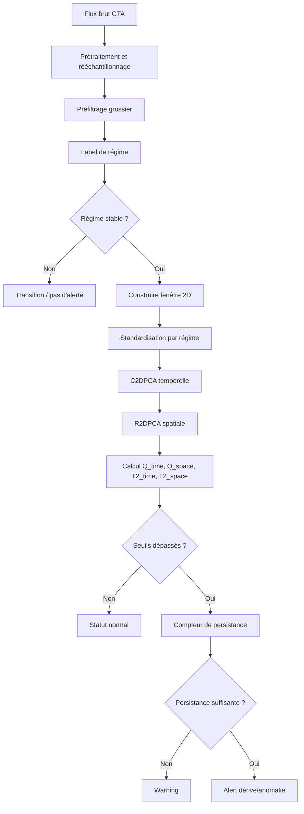

# Bi2DPCA dynamique par régime pour un GTA

## Résumé exécutif

Pour un GTA surveillé via les variables **HP, MP, BP, EE**, la version fidèle à la méthode Bi2DPCA consiste à faire une **surveillance dynamique par régime** fondée sur des **fenêtres 2D** et la chaîne **C2DPCA-R2DPCA**. Chaque fenêtre est traitée comme une matrice `temps × variables` ; la réduction temporelle capte l’autocorrélation, puis la réduction sur les variables capte la structure croisée normale entre `HP`, `MP`, `BP`, `EE` et les variables contextuelles éventuelles.

**Principe de V1** :

1. préfiltrer les données brutes ;
2. identifier ou recevoir les labels de régime ;
3. construire un jeu sain candidat, puis un jeu sain final par régime ;
4. standardiser par régime ;
5. construire des fenêtres 2D `A ∈ R^(t×m)` ;
6. entraîner un modèle **C2DPCA-R2DPCA par régime** ;
7. calculer en ligne `Q_time`, `Q_space` et, en option, `T2_time`, `T2_space` ;
8. fixer des seuils par régime via **KDE** et/ou **quantiles empiriques** ;
9. déclencher `warning` / `alert` selon le dépassement des seuils, la stabilité du régime et une logique de **persistance**, sans prédiction `EE_pred` en V1.

**Principe de V2 optionnelle** :

- conserver la V1 inchangée ;
- ajouter, dans un composant séparé, un cross-check énergétique optionnel ;
- ne jamais utiliser ce composant pour redéfinir la logique centrale Bi2DPCA de V1.

## Pré-requis

### Hypothèses à fixer par l’implémenteur

Les points suivants doivent être décidés avant codage :

- pas d’échantillonnage nominal de la source brute ;
- variables disponibles au-delà de `HP`, `MP`, `BP`, `EE` ;
- source des labels de régime : règles métier, clustering, ou hybride ;
- définition du jeu sain candidat et du jeu sain final ;
- taux de fausse alarme acceptable ;
- durée minimale de persistance avant alerte ;
- fréquence acceptable de recalibrage du modèle.

### Entrées minimales

| Entrée | Type | Obligatoire | Commentaire |
|---|---|---:|---|
| horodatage | série temporelle | oui | index strictement croissant |
| HP, MP, BP | séries numériques | oui | variables surveillées dans la matrice 2D |
| EE | série numérique | oui | variable surveillée dans la matrice 2D, non prédite en V1 |
| label de régime | série catégorielle | oui | issue des règles métier, du clustering ou des deux |
| indicateur sain/anormal | série binaire ou périodes | fortement recommandé | utile pour sélectionner le jeu sain par régime |
| variables contextuelles | séries numériques | optionnel | pressions, températures, vannes, états machine |

Si seules `HP`, `MP`, `BP`, `EE` sont disponibles, le modèle reste faisable. Si des variables de contexte existent, elles doivent être ajoutées à la matrice 2D pour enrichir la structure croisée.

### Sorties minimales

Chaque évaluation en ligne doit produire :

| Sortie | Type | Rôle |
|---|---|---|
| `score_Q_time` | flottant | anomalie d’autocorrélation temporelle |
| `score_Q_space` | flottant | anomalie de structure croisée |
| `score_T2_time` | flottant | optionnel, énergie dans le sous-espace temporel retenu |
| `score_T2_space` | flottant | optionnel, énergie dans le sous-espace spatial retenu |
| `window_flag` | booléen | au moins un score dépasse son seuil |
| `status_window` | catégorie | normal / warning / alert / transition / inconnu |
| `regime_id` | catégorie | régime appliqué |
| `reason_codes` | liste de tags | ex. `Q_time_high`, `Q_space_high`, `transition_regime`, `unknown_regime` |

### Modes de produit

| Mode | Description | Règle de décision |
|---|---|---|
| **V1 fidèle PDF** | Bi2DPCA par régime, sans prédiction EE | `Q_time`, `Q_space`, `T2_*` optionnels, seuils, persistance |
| **V2 optionnelle** | V1 inchangée + cross-check énergétique séparé | la détection V1 reste souveraine ; le cross-check enrichit l’interprétation |

## Pipeline des données

### Préfiltrage grossier avant labels de régime

Avant clustering ou affectation des labels de régime, construire un masque **données exploitables** :

1. tri temporel et déduplication ;
2. gestion d’un pas régulier par rééchantillonnage si nécessaire ;
3. exclusion des arrêts, démarrages et transitions manifestes ;
4. exclusion des valeurs hors plages physiques ;
5. exclusion des trous longs et des capteurs bloqués ;
6. conservation d’un historique candidat pour l’apprentissage des régimes.

Ce masque ne constitue pas encore le jeu sain final ; il sert à éviter que les régimes soient appris sur des données manifestement inutilisables.

### Construction des régimes

Le document de projet ne fige pas la source des régimes. En pratique :

- priorité aux **règles métier** si elles existent ;
- sinon clustering sur variables de fonctionnement stables ;
- sinon approche hybride, avec clustering initial puis validation métier.

Recommandation pragmatique de départ :

- variables de régime : `HP`, `MP`, `BP` et variables de contexte de conduite ;
- ne pas utiliser un éventuel modèle de prédiction EE pour définir les régimes ;
- lisser les labels dans le temps avant fenêtrage.

### Construction des fenêtres 2D

Un échantillon de monitoring est une matrice `A ∈ R^(t×m)` où les lignes correspondent aux temps successifs et les colonnes aux variables.

```text
A_w = [HP, MP, BP, EE, ... variables contextuelles] sur une durée fixe
dimensions = t points × m variables
```

Variables à inclure par défaut dans l’ordre :

```text
[HP, MP, BP, EE]
```

`EE` reste **une variable surveillée**, pas une variable prédite dans le cœur de V1.

### Taille de fenêtre et rééchantillonnage

Formule :

```text
t = durée_fenêtre / pas_échantillonnage
```

Point de départ recommandé :

- données brutes à 15 s ou 30 s : rééchantillonner à **1 min** ;
- fenêtre initiale : **2 h** ;
- donc `t = 120` points si pas = 1 min ;
- alternative plus légère : **5 min / 2 h / 24 points**.

### Chevauchement et pas de glissement

Pour l’offline :

- overlap `50 %` ;
- stride `t/2`.

Pour l’online :

- stride = `1 pas rééchantillonné` si l’on veut une détection fine ;
- sinon `5 min` ou `15 min` selon la charge calcul.

## Entraînement par régime

### Jeu sain par régime

Pour chaque régime `r` :

- ne garder que les fenêtres entièrement contenues dans le régime ;
- exclure les fenêtres qui contiennent un changement de régime ;
- exclure les arrêts/démarrages ;
- exclure les données manquantes longues ;
- exclure les anomalies déjà étiquetées ;
- si aucun label sain n’est disponible, partir d’un jeu sain candidat grossier puis nettoyer par quantiles robustes sur les scores du régime.

### Split temporel recommandé

Sur 6 mois de données, par régime :

- train : `60 %` à `70 %` des plus anciennes périodes saines ;
- calibration seuils : `15 %` à `20 %` suivantes ;
- test : le reste, en conservant les événements connus.

Ne pas faire de split aléatoire.

### Algorithme C2DPCA-R2DPCA à coder

Soit un ensemble de fenêtres standardisées `A_i ∈ R^(t×m)` pour un régime donné.

#### Étape temporelle

```text
G_time = mean_i (A_i A_i^T)      # taille t × t
V = eigvecs_top_d(G_time)        # taille t × d
lambda_time = eigvals_top_d(G_time)
D_i = V^T A_i                    # taille d × m
```

#### Étape spatiale

```text
G_space = mean_i (D_i^T D_i)     # taille m × m
U = eigvecs_top_p(G_space)       # taille m × p
lambda_space = eigvals_top_p(G_space)
F_i = D_i U                      # taille d × p
```

### Choix du nombre de composantes

Défaut recommandé :

```text
CPV_time = 85 %
CPV_space = 85 %
```

À tester ensuite :

```text
85 %, 90 %, 95 %
```

Garde-fous pratiques :

- `1 ≤ p ≤ min(m-1, 4)` pour un modèle minimal ;
- `1 ≤ d ≤ min(t-1, 20)` pour garder une dimension temporelle compacte au début ;
- si `m = 4` avec `[HP, MP, BP, EE]`, commencer souvent par `p = 2` ou `3` si CPV le permet.

## Indices de monitoring et décision

### Indices à calculer

Pour **C2DPCA-R2DPCA**, calculer :

- `Q_time` = anomalie de reconstruction après projection temporelle ;
- `Q_space` = anomalie de reconstruction après projection spatiale ;
- `T2_time` = énergie normalisée dans le sous-espace temporel retenu ;
- `T2_space` = énergie normalisée dans le sous-espace spatial retenu.

Formes directement codables :

```text
Q_time(A)  = || A - V V^T A ||_F^2
D          = V^T A
Q_space(A) = || D - D U U^T ||_F^2
```

Version simple pour les T² :

```text
T2_time(A)  = Σ_j ||D[j, :]||^2 / lambda_time[j]
F           = D U
T2_space(A) = Σ_k ||F[:, k]||^2 / lambda_space[k]
```

Conseil MVP : commencer avec `Q_time` et `Q_space`, puis ajouter `T2_time` et `T2_space` si la calibration reste propre.

### Seuils

Mettre en place deux modes :

#### Mode statistique

```text
threshold_stat = quantile_KDE(score_train_healthy, 0.99)
```

#### Mode empirique

```text
threshold_emp = plus petit seuil respectant le FAR cible
```

Exemple :

```text
FAR cible = 0.5 % à 2 % selon criticité
```

Choix recommandé au démarrage :

```text
threshold = max(threshold_stat, threshold_emp)
```

### Logique de décision V1

Détection instantanée :

```text
window_flag = (
    Q_time  > th_Q_time
    or Q_space > th_Q_space
    or T2_time > th_T2_time
    or T2_space > th_T2_space
)
```

`warning` si :

- `window_flag = True` ;
- la fenêtre appartient à un régime stable.

`alert` si :

- une proportion suffisante de fenêtres récentes dépasse les seuils ;
- la fenêtre reste dans un régime stable ;
- la condition de persistance temporelle est atteinte.

Défauts conseillés :

```text
horizon_persistance = 2 h
ratio_fenêtres_en_dépassement = 60 %
```

Exprimé en nombre de fenêtres :

```text
n_persist = ceil(horizon_persistance / stride_online)
```

Règle robuste de départ :

```text
ALERT si
  proportion(des fenêtres en dépassement dans les 2 dernières heures) >= 60 %
```

### Priorité des indices

Recommandation minimaliste :

```text
priorité 1 : Q_time, Q_space
priorité 2 : T2_time, T2_space
priorité 3 : codes de persistance et stabilité du régime
```

### Cross-check énergétique V2 séparé

Si une V2 est activée, elle doit être **séparée** du cœur Bi2DPCA :

- calculée dans un composant distinct ;
- non bloquante pour la décision V1 ;
- utilisée pour qualification métier, priorisation ou visualisation ;
- jamais utilisée pour redéfinir rétroactivement les seuils Bi2DPCA de V1.

## Déploiement en ligne

### Stratégie online recommandée

Version initiale simple :

1. appliquer le même prétraitement et le même rééchantillonnage qu’en offline ;
2. obtenir le régime courant ;
3. si le régime a changé récemment, classer la fenêtre en `transition` et ne pas scorer ;
4. sinon construire la dernière fenêtre `A_t` ;
5. standardiser avec le scaler du régime ;
6. calculer `Q_time`, `Q_space` et les `T2` éventuels ;
7. comparer aux seuils du régime ;
8. appliquer la logique de persistance ;
9. retourner un statut `normal`, `warning`, `alert`, `transition` ou `unknown_regime`.

### Mise à jour des modèles

Pour éviter qu’un modèle online n’absorbe progressivement une dérive réelle :

- modèle gelé en ligne ;
- recalibrage offline périodique seulement sur des données revues comme saines ;
- cadence typique : hebdomadaire si l’exploitation change souvent, mensuelle sinon.

Ne pas faire d’adaptation continue du sous-espace dans la V1.



## Tests et validation

### Plan de validation recommandé

Créer trois niveaux d’évaluation.

#### Validation seuils sur données saines

Objectif : vérifier le niveau de bruit de fond.

Mesures :

- `FAR` par régime ;
- `FAR` global ;
- temps moyen entre fausses alertes.

#### Validation de détection sur événements connus

Objectif : voir si l’algorithme déclenche réellement.

Mesures :

- `TPR` ;
- `NDR` ;
- délai de détection ;
- fraction d’événements détectés avant intervention.

#### Validation métier

Objectif : vérifier la cohérence des alertes avec les événements connus, les transitions d’exploitation et l’évolution observée de `EE`.

Mesures :

- fréquence des alertes en régime stable ;
- fréquence des alertes pendant les transitions ;
- cohérence des alertes avec les événements exploitation ;
- en V2 seulement : cohérence avec le cross-check énergétique séparé.

### Tests minimaux à exécuter

| Test | Ce qu’il vérifie | Sortie |
|---|---|---|
| test reconstruction saine | scores bas sur train/calib sains | distribution Q/T² |
| test robustesse missing | comportement si quelques trous restent | pas d’explosion numérique |
| test changement de régime | absence d’alerte sur transitions exclues | taux de faux positifs sur transitions |
| test dérive injectée | sensibilité à une dérive progressive sur la dynamique ou la relation multivariable | délai de détection |
| test anomalie impulsive | pas d’alerte durable sur un pic isolé | warning sans alert |
| test seuils | stabilité des quantiles/KDE | FAR cible respecté |

### Courbes et graphiques à produire

| Graphique | Usage |
|---|---|
| série temporelle `Q_time` avec seuil | visualiser anomalies dynamiques temporelles |
| série temporelle `Q_space` avec seuil | visualiser rupture multivariable |
| série temporelle `T2_time` et/ou `T2_space` avec seuil | audit des composantes retenues |
| état `warning/alert` dans le temps | audit de la logique de décision |
| série des labels de régime | audit du routage vers le bon modèle |
| matrice confusion binaire | normal vs événement |
| courbe FAR vs quantile seuil | calibrage |
| courbe délai de détection vs persistance | arbitrage réactivité / robustesse |

## Paramètres à calibrer et annexes

### Paramètres à calibrer

| Paramètre | Départ recommandé | Commentaire |
|---|---:|---|
| variables utilisées | `HP, MP, BP, EE` | ajouter les variables contextuelles si disponibles |
| pas rééchantillonné | `1 min` | alternative sobre : `5 min` |
| durée fenêtre | `2 h` | tester aussi `30 min`, `1 h` |
| overlap offline | `50 %` | augmente le nombre de fenêtres |
| stride online | `1 pas` à `5 min` | dépend du coût calcul |
| CPV temporel `d` | `85 %` | tester `90 %`, `95 %` |
| CPV spatial `p` | `85 %` | tester `90 %`, `95 %` |
| seuil statistique | `99e percentile` | conforme à la pratique décrite pour Bi2DPCA |
| FAR cible | `0.5 %` à `2 %` | à fixer par exploitation |
| horizon de persistance | `2 h` | exprimer en fenêtres selon le stride |
| ratio de dépassement | `60 %` | sur l’horizon de persistance |
| durée train saine | `≥ 4 semaines` par régime si possible | minimum : plusieurs centaines de fenêtres saines |
| fréquence de recalibrage | mensuelle | plus fréquente si régime instable |

### Pseudocode offline

```python
def train_bi2dpca_per_regime(
    df,
    regime_col,
    healthy_col,
    variables,
    dt_minutes,
    window_minutes=120,
    overlap=0.5,
    cpv_time=0.85,
    cpv_space=0.85,
    threshold_quantile=0.99,
):
    models = {}
    t = int(window_minutes / dt_minutes)
    stride = max(1, int(t * (1 - overlap)))

    for regime_id in sorted(df[regime_col].dropna().unique()):
        sub = df[(df[regime_col] == regime_id) & (df[healthy_col])].copy()
        sub = drop_transition_points(sub, regime_col)

        train_df, calib_df, test_df = time_split(sub, train=0.7, calib=0.15, test=0.15)

        scaler = fit_standard_scaler(train_df[variables])
        train_x = scaler.transform(train_df[variables])
        calib_x = scaler.transform(calib_df[variables])

        A_train = build_2d_windows(train_x, t=t, stride=stride)
        A_calib = build_2d_windows(calib_x, t=t, stride=stride)

        G_time = mean([A @ A.T for A in A_train])
        eigvals_t, eigvecs_t = eigh_desc(G_time)
        d = choose_rank_by_cpv(eigvals_t, cpv_time)
        V = eigvecs_t[:, :d]
        lambda_time = eigvals_t[:d]

        D_train = [V.T @ A for A in A_train]
        D_calib = [V.T @ A for A in A_calib]

        G_space = mean([D.T @ D for D in D_train])
        eigvals_s, eigvecs_s = eigh_desc(G_space)
        p = choose_rank_by_cpv(eigvals_s, cpv_space)
        U = eigvecs_s[:, :p]
        lambda_space = eigvals_s[:p]

        train_scores = [score_window(A, V, U, lambda_time, lambda_space) for A in A_train]
        calib_scores = [score_window(A, V, U, lambda_time, lambda_space) for A in A_calib]

        thresholds = fit_thresholds(train_scores, calib_scores, q=threshold_quantile)

        models[regime_id] = {
            "variables": variables,
            "dt_minutes": dt_minutes,
            "window_minutes": window_minutes,
            "t": t,
            "stride": stride,
            "scaler": scaler,
            "V": V,
            "U": U,
            "lambda_time": lambda_time,
            "lambda_space": lambda_space,
            "thresholds": thresholds,
        }

    return models
```

### Pseudocode scoring online

```python
def score_online(
    buffer_df,
    models,
    current_regime,
    persistence_state,
    persistence_minutes=120,
    exceed_ratio_threshold=0.60,
):
    if current_regime not in models:
        return {"status": "unknown_regime"}

    model = models[current_regime]

    if regime_not_stable(buffer_df, current_regime, model["window_minutes"]):
        return {"status": "transition"}

    variables = model["variables"]
    t = model["t"]

    x = model["scaler"].transform(buffer_df[variables].tail(t))
    A = x.reshape(t, len(variables))

    scores = score_window(
        A,
        model["V"],
        model["U"],
        model["lambda_time"],
        model["lambda_space"],
    )

    exceed = (
        scores["Q_time"]  > model["thresholds"]["Q_time"]
        or scores["Q_space"] > model["thresholds"]["Q_space"]
        or scores.get("T2_time", 0.0) > model["thresholds"].get("T2_time", float("inf"))
        or scores.get("T2_space", 0.0) > model["thresholds"].get("T2_space", float("inf"))
    )

    persistence_state.update(exceed=exceed, regime=current_regime)

    if exceed and persistence_state.exceed_ratio_minutes(persistence_minutes) >= exceed_ratio_threshold:
        status = "alert"
    elif exceed:
        status = "warning"
    else:
        status = "normal"

    return {
        "status": status,
        "regime": current_regime,
        "scores": scores,
        "window_flag": bool(exceed),
        "reason_codes": build_reason_codes(scores, model["thresholds"], current_regime),
    }
```

### Fonction de score minimale

```python
def score_window(A, V, U, lambda_time, lambda_space):
    D = V.T @ A
    A_hat_time = V @ D

    F = D @ U
    D_hat_space = F @ U.T

    Q_time = ((A - A_hat_time) ** 2).sum()
    Q_space = ((D - D_hat_space) ** 2).sum()

    T2_time = sum((D[j, :] ** 2).sum() / max(lambda_time[j], 1e-12) for j in range(len(lambda_time)))
    T2_space = sum((F[:, k] ** 2).sum() / max(lambda_space[k], 1e-12) for k in range(len(lambda_space)))

    return {
        "Q_time": float(Q_time),
        "Q_space": float(Q_space),
        "T2_time": float(T2_time),
        "T2_space": float(T2_space),
    }
```

### Notes d’implémentation à respecter

Règles à ne pas violer :

```text
ne jamais comparer des fenêtres appartenant à des régimes différents
ne jamais alerter sur une fenêtre de transition
ne pas introduire EE_pred dans le cœur de V1
```
